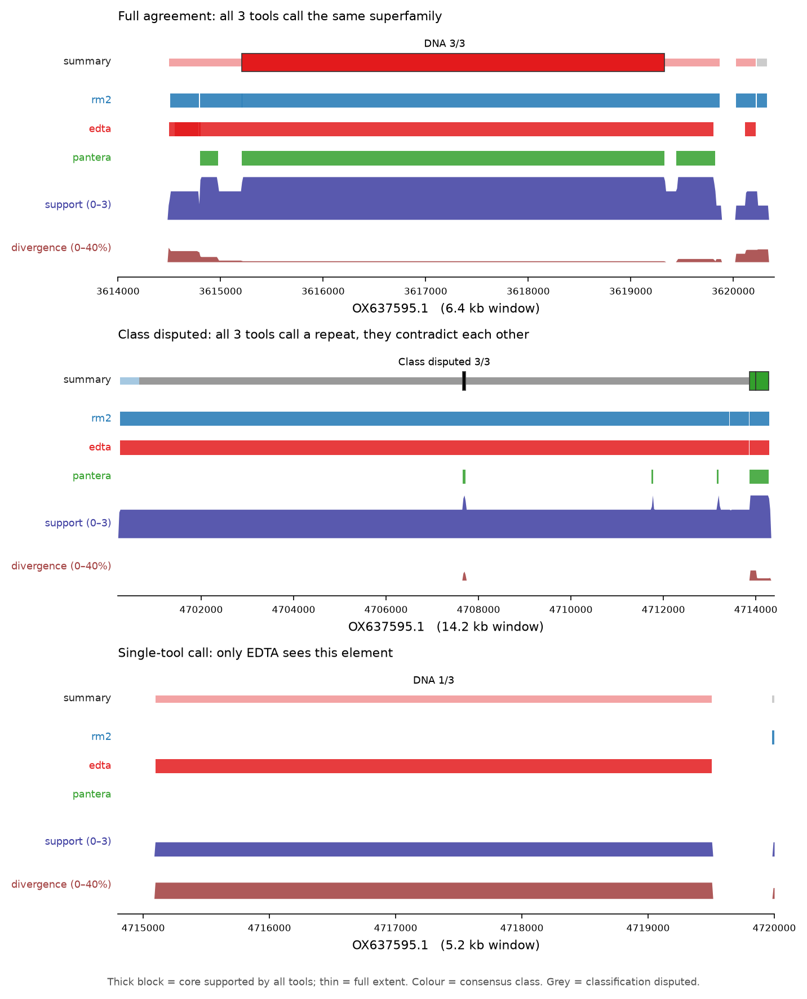

# An integrated TE track for the Vertebrate Genomes Project

> ## ⚠️ Under active development — not for research use
>
> **This repository is a working prototype. Do not use these tracks or this
> pipeline as a source of repeat annotation for research.**
>
> - Output has **not been benchmarked** against a curated truth set. We do not
>   currently know its error rate.
> - The class vocabulary is **provisional** (`dfam-rm-2026.1-draft`) and will be
>   revised when the unified Dfam/Repbase classification is released. Class
>   labels may change.
> - Formats, field names and semantics **will change without notice** and
>   without migration paths.
> - Only **one assembly** has been processed end to end, with **three of four**
>   intended tools.
> - This is **not** the official VGP repeat annotation. It is a transparency
>   layer showing what existing tools currently say, published while the
>   official pipeline is being developed.
>
> Much of this code and documentation was AI-drafted and human-reviewed — see
> [AI usage disclosure](#ai-usage-disclosure).
>
> If you need repeat annotation for analysis today, run a tool you can cite and
> validate yourself. If you want to help us make this trustworthy, see
> [Contributing](#contributing).

---

## Purpose

Many repeat-annotation tools are run on Vertebrate Genomes Project assemblies,
and they disagree — about where repeats are, how far they extend, and what they
are. This project publishes those disagreements **as evidence rather than as a
verdict**.

Nothing is filtered on the basis of agreement. A locus called by one tool alone
is displayed as prominently as one called by all of them. Where tools disagree,
the disagreement is encoded in the display rather than resolved away.

This is deliberately *not* a merged annotation. Merging requires deciding whose
boundary and whose classification wins, and that decision is exactly what the
official pipeline is being built to make. Until then, the honest product is the
evidence.

## What it produces

A UCSC-style assembly track hub (also loadable in IGV) containing:

| Track | What it shows |
|---|---|
| **repeatSummary** | consensus call per element — class, how many tools support it, how deeply they agree, and thick/thin geometry showing where they agree on boundaries |
| **repeatSupport**, **repeatSupportFrac**, **repeatDivergence** | per-base signals at full resolution, not display-merged |
| **toolUnique** | intervals called by exactly one tool — where the tools disagree most |
| **repeat_\<tool\>** | each tool's full unmodified output, with its own class label preserved verbatim |



*Three contrasting loci. Thick block = the core every eligible tool agreed on;
thin = full extent. Top: all three tools agree to superfamily. Middle: all three
call a repeat but contradict each other on class (grey), so the agreed core is a
57 bp sliver of a 13 kb feature. Bottom: a single-tool call.*

## Status

Processed end to end on one assembly: `GCA_951799975.1` (*Gobius niger*, black
goby), with nine tools: RepeatModeler2, EDTA, Pantera, FasTAN, fastLTR,
LTRDeNovo, Satellome, and — pulled straight from the assembly's public GenArk
track set — TRF (simpleRepeat) and WindowMasker (WM + SDust). The GenArk pair
are the first inputs rebuildable for any VGP assembly with no local files
(see [docs/GENARK_TRACKS.md](docs/GENARK_TRACKS.md)).

Four of the six inputs are rebuildable from public GenomeArk data — see
[docs/FASTLTR.md](docs/FASTLTR.md) and [docs/EDTA.md](docs/EDTA.md) for the S3
keys and the converters. Two are supplied locally for now: Pantera, because
GenomeArk publishes its TE *library* (196 consensus sequences) but not the
RepeatMasker annotation ([docs/PANTERA.md](docs/PANTERA.md)); and LTRDeNovo,
which is not on GenomeArk at all ([docs/LTRDENOVO.md](docs/LTRDENOVO.md)).

| | |
|---|---|
| Assembly | 870.6 Mb |
| Covered by ≥1 tool | 464.0 Mb (53.3%) |
| Summary segments | 4,669,060 |
| Display features | 1,942,951 |
| Classified `repeat:TE*` / `repeat:tandem*` | 352.0 Mb / 61.2 Mb |
| Conflicted | 132.3 Mb |
| Mean divergence (over 427.1 Mb) | 12.17% |
| Validation | `hubCheck` clean |

Per-tool coverage, and the fraction no other tool calls:

| tool | covered | unique |
|---|---|---|
| RepeatModeler2 | 409.0 Mb | 60.4 Mb |
| EDTA | 322.3 Mb | 14.3 Mb |
| Pantera | 229.1 Mb | 2.2 Mb |
| FasTAN | 96.3 Mb | 32.5 Mb |
| fastLTR | 10.6 Mb | 0.01 Mb |
| LTRDeNovo | 5.7 Mb | 0.15 Mb |

Adding tools in that order, the union saturates: 409.0 → 428.8 → 431.3 → 463.8
→ 463.9 → 464.0 Mb. Only FasTAN adds substantial new territory (+32.5 Mb),
because it is the only tandem-repeat specialist in the set. Pantera adds just
2.2 Mb of its own but has the lowest pairwise Jaccard among the three homology
tools (0.542 against RepeatModeler2, 0.526 against EDTA), so it contributes the
most independent *support* per bp.

The two LTR specialists behave very differently. fastLTR adds almost no
territory but 98.1% of what it calls falls on loci the summary independently
classifies as LTR — corroboration rather than extension. LTRDeNovo overlaps
fastLTR at a Jaccard of only 0.102 (73.4% of its bp are not called by fastLTR
at all), yet just 37.3% of its territory is classified LTR by the consensus.
That figure splits sharply by detection method — 85.4% for its 228 structural
calls, 13.7% for its 2,876 homology calls — which is documented in
[docs/LTRDENOVO.md](docs/LTRDENOVO.md) and is worth understanding before
treating an LTRDeNovo homology call as an LTR annotation.

Support is broadly distributed: 110 Mb rests on a single tool, 135 Mb on two,
185 Mb on three, 32 Mb on four, 1.6 Mb on five, and 0.01 Mb on all six.

These numbers describe **what the tools said**, not what is true. See
[Known limitations](docs/SPECIFICATION.md#9-known-limitations).

## Quickstart

Requires Python ≥3.10 with pandas and numpy, plus the UCSC utilities
`bedToBigBed`, `bedGraphToBigWig`, `bigBedInfo` and `hubCheck` on your `PATH`
(from [hgdownload](https://hgdownload.soe.ucsc.edu/admin/exe/)).

Build a hub from the bundled 1.4 Mb test slice — takes about a second:

```bash
python -m vgptrack.cli build \
    --assembly TESTASM \
    --sizes tests/data/test.chrom.sizes \
    --bed rm2=tests/data/rm2.bed.gz \
    --bed edta=tests/data/edta.bed.gz \
    --bed pantera=tests/data/pantera.bed.gz \
    --allow-missing \
    --out hub --description "test slice"
```

`--allow-missing` is needed because the slice predates fastLTR and FasTAN: the
manifest records `ran=yes` for them, and the build refuses by default to ship a
documented tool as an empty track. See [Guard against a forgotten
input](#guard-against-a-forgotten-input).

Expected output: `9,350 segments over 1,025,484 bp`, `3,725 display features`,
`hubCheck clean`.

On a real assembly, add `--alias` (tools use different sequence-naming
authorities, so this is effectively required) and `--twobit`:

```bash
python -m vgptrack.cli build \
    --assembly GCA_951799975.1 \
    --sizes GCA_951799975.1.chrom.sizes \
    --alias GCA_951799975.1.chromAlias.txt \
    --bed rm2=rm2.bed --bed edta=edta.bed --bed pantera=pantera.bed \
    --out hub --description "Gobius niger (black goby)" \
    --twobit https://hgdownload.soe.ucsc.edu/hubs/GCA/951/799/975/GCA_951799975.1/GCA_951799975.1.2bit
```

Adding a tool is a `--bed` argument plus a row in `config/tools.tsv`. Tools in
the manifest without a `--bed` become empty placeholder tracks automatically.

### Viewing in IGV

```bash
python -m vgptrack.cli session --hub hub/GCA_951799975.1 --out igv_session.xml
```

writes an IGV session plus a genome descriptor that streams the reference from
UCSC GenArk, so there is nothing to download. See [docs/TESTING.md](docs/TESTING.md).

### Guard against a forgotten input

If `config/tools.tsv` records `ran=yes` for a tool but no `--bed` is given for
it, `build` aborts:

```
error: config/tools.tsv records ran=yes for ['pantera'], but no --bed was given,
       so they would ship as empty tracks and reduce the repeatSupport ceiling.
```

A tool omitted from the command line otherwise ships as a valid, empty,
zero-feature bigBed — the hub builds, `hubCheck` passes, and the only symptom is
a `repeatSupport` ceiling one lower than it should be. That is easy to miss, and
[was missed once](docs/PANTERA.md#history). Resolve it by supplying the input,
setting `ran=no` in the manifest if the tool genuinely has no coordinates for
this assembly, or passing `--allow-missing` to build anyway (which downgrades
the error to a warning).

## How it works

1. **Ingest** — each tool provides a standardized BED16
   ([INPUT_FORMAT.md](docs/INPUT_FORMAT.md)); coordinates
   validated against `chrom.sizes`, sequence names reconciled via chromAlias.
2. **Harmonize** — each tool's class label is mapped onto a shared hierarchy via
   `config/class_map.tsv`. The tool's original label is always preserved.
3. **Segment** — per-base state, run-length encoded. Support counts **distinct
   tools**, carried as a bitmask, so one tool's overlapping calls cannot inflate
   it.
4. **Aggregate into elements** — boundary disagreement is absorbed into BED12
   thick/thin geometry rather than merged away.
5. **Build tracks** — bigBed/bigWig via the UCSC utilities, validated with
   `hubCheck`.

Full detail in [docs/SPECIFICATION.md](docs/SPECIFICATION.md).

## Repository layout

```
vgptrack/          pipeline package
  ingest.py        BED16 reading, validation, class harmonization
  segment.py       per-base segmentation and agreement resolution
  summary.py       element aggregation and the summary track
  hub.py           per-tool tracks, discordance track, hub files
  bigfiles.py      UCSC utility wrappers
  igvsession.py    IGV session/genome writers
  cli.py           command-line driver
config/            tool manifest, class vocabulary, colour palette  (data, not code)
docs/              input format (normative), specification, testing guide, design notes
tests/data/        1.4 Mb slice for a runnable end-to-end example
scripts/           tool-output → BED16 converters
report/, qc/       concordance figures and ingest QC from the goby run
```

`config/class_map.tsv` is **data, not code**. It carries a version header and a
provisional-status marker; re-running against a new version rebuilds every track
and nothing in the pipeline hardcodes a class name.

## Contributing

Most useful right now:

- **A curated truth set** for any vertebrate assembly, so the output can finally
  be benchmarked rather than merely described.
- **Vocabulary review** — `config/class_map.tsv` maps 135 observed labels onto a
  Wicker-style hierarchy. Mapping errors silently become false disagreement.
- **Converters** for new tools (`scripts/`). For supported tools the native
  output + converter is the preferred ingest — the converter extracts
  everything the native format offers and documents what cannot be carried.
  For tools without a converter, the
  [BED16 input format](docs/INPUT_FORMAT.md) is the interchange: supply that
  and the tool joins the build with no new code.
- **Design critique** — the open questions are collected in
  [docs/DESIGN_NOTES.md](docs/DESIGN_NOTES.md).

## AI usage disclosure

**Much of the code and documentation in this repository was written with an AI
assistant (Anthropic's Claude), working interactively with the maintainer.** We
disclose this for the same reason the development-status warning above exists:
you should know what you are looking at before you rely on it.

What that means concretely:

- **Design decisions are human.** What the tracks represent, how disagreement is
  encoded, what counts as support, and the decision not to merge tools into a
  single answer were specified by the maintainer.
- **Most implementation and prose were AI-drafted**, then reviewed, corrected
  and tested by the maintainer. Commits made by the assistant carry a
  `Co-authored-by:` trailer.
- **Verification does not depend on trusting either of us.** Every quantitative
  claim in the README and [SPECIFICATION.md](docs/SPECIFICATION.md) is derived
  from the built tracks, the bundled test slice reproduces its documented output
  exactly, and hubs are validated with UCSC `hubCheck`. Re-run the quickstart
  and check.
- **The known limitations are unchanged by this.** The output is not
  benchmarked, and no amount of code review substitutes for a curated truth set
  — see [Known limitations](docs/SPECIFICATION.md#9-known-limitations).

Treat AI-drafted code the way you would treat code from any unfamiliar
contributor: read it before depending on it, and report anything that looks
wrong. Bug reports are welcome and useful.

## Citing

Please **don't** cite this yet. There is nothing benchmarked to cite. If it is
useful in preparing work, link to this repository and state the commit.

## License

GPL-3.0. See [LICENSE](LICENSE).
